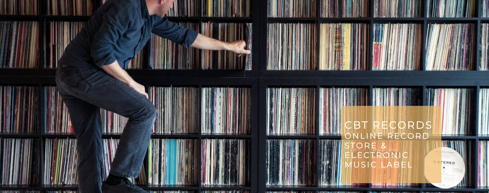
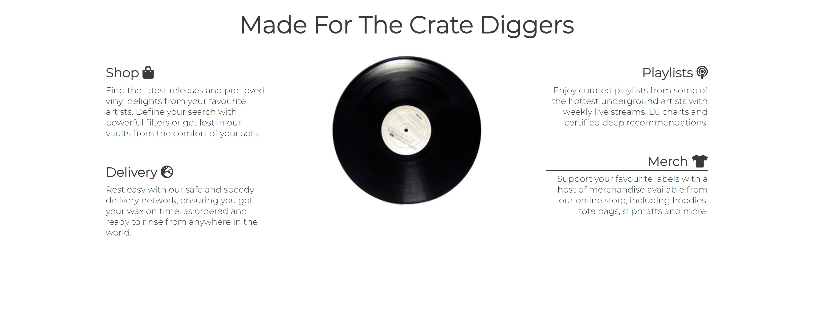
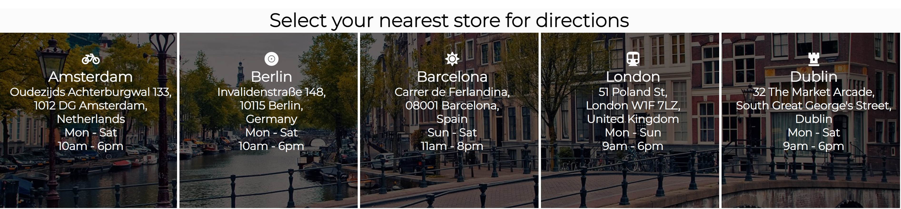
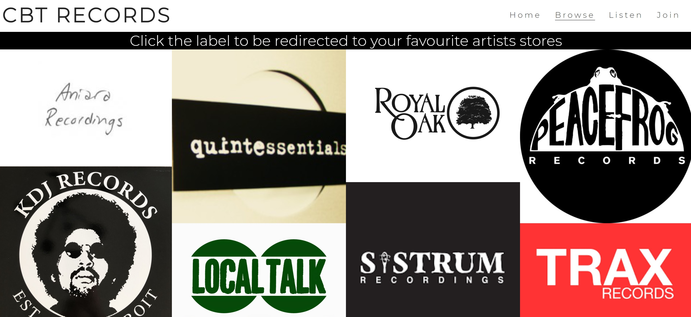
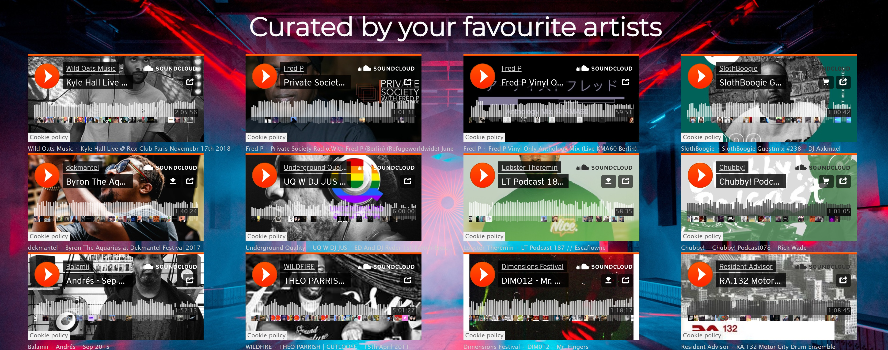
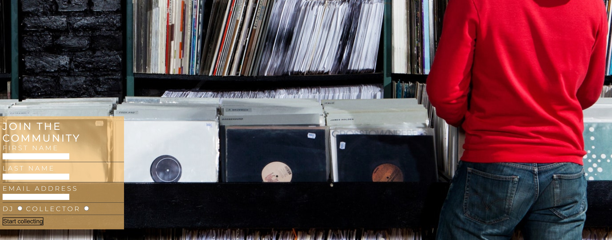

## CBT Records

### CBT Records is an online vinyl record store and electronic music label that hopes to create a direct connection between collectors and artists in the electronic music scene worldwide. It's aim is to market new music, events, merchandise and records sales, both online and in mockup physical stores. It's revenue would be generated via traffic to the artists direct sites.

### The site will be targeted towards artists, labels, djs & collectors, who are looking for one single place to discover, purchase, sell and promote music from. The site will also be a platform for creatives to share ideas, mixes, resources, events, tips, reviews and more. 

## Existing Features
### Navigation Bar

### Featured on all four pages, the fully responsive navigation bar includes links to the logo, home, browse, listen and join pages and is identical in each page to allow for easy navigation. This section will allow the user to easily navigate from page to page across all devices without having to revert back to the previous page via the ‘back’ button.

## The landing page image

### The landing includes a photograph of a collector browsing though a record collection with text overlay to allow the user to see exactly what the site would be applicable to. This section introduces the user to CBT Records with an eye catching animation to grab their attention. Audio plays on launch to give an insight into the type of music the site is geared towards.

## Shop Ethos Section

### The shop ethos section will allow the user to see the benefits of joining the CBT records online community. This user will see the value of signing up for the CBT records. This should encourage the user to consider CBT as their sole source for discovering new music and events.

## Physical locations section

### This section will allow the user to see where the mockup physical stores are located, with related city icons, addresses and opening hours in each column. Each section will be anchored to launch Google Maps in a new tab when clicked. This section will be updated as these times change to keep the user up to date.

## The Footer

### The footer section includes links to the relevant social media sites for CBT records. The links will open to a new tab to allow easy navigation for the user. The footer is valuable to the user as it encourages them to keep connected via social media.

## Browse page

### The Browse page will provide the user with supporting images to the record labels available to choose from. This section is valuable to the user as they will be able to easily identify the label they want to browse music from, via distiguishable logos nested within a clickable link that will launch the artists local site in a new tab.

## The Listen Page

### This page will provide users with embedded Soundcloud links to artists live sets and new releases weekly. The user will be able to listen to and discover music directly from the site.

## The Join Page

### This page will allow the user to get signed up to CBT Records to start their collecting journey within the community. The user will be able specify if they are shopping as a DJ or collector. The user will be asked to submit their full name and email address.

## Features left to implement

## *Merchandise page*

### This page would allow a user to browse various merchandise available from different artists and labels hosted, with links to connect with the direct store from the artists site.

## Another feature idea

## *Forum*

### This section would act as an online forum for site users to discuss releases, events, concepts and more.

## *Order*

### This section would act as a central location to place one order from numerous sites. The aim would be to reduce shipping fees with one single umbrella type purchase.

## Testing
### In testing the site, I first ensured the heading nav bar was fully functional with the logo and all four pages navigating with the same style applied. I ensured the landing page zoom style works on launch. I went through each google map anchor in the physical locations section divs, which successfully launch in a new tab when selected. In the Browse page I tested each linked label image, which succesfully launches the label/artists site directly in a new tab. I tested all embedded Soundcloud links in the Listen page. Lastly I tested the Join page, validating each input of the form and submitting with a succesful result.

### The project has also been tested to be responsive on tablet and mobile devices using developer tools.

## Validator Testing

## HTML
### No errors on HTML on all pages were returned when passing through the official W3C validator.
### 5 warnings are noted on index.html. This is due to the icons placed above the physical location text in the div. To maintain size and style, I added the icons within h2 elements. No additional text was required.
### 1 warning was noted on browse.html for not having a header in my section. However this was a personal choice.

## CSS
### No errors were found when passing through the official (Jigsaw) validator

## Deployment
### The site was deployed to GitHub pages. The steps to deploy are as follows:
* In the GitHub repository, navigate to the Settings tab
* From the source section drop-down menu, select the Master Branch
* Once the master branch has been selected, the page will be automatically refreshed with a detailed ribbon display to indicate the successful deployment.
* The live link can be found here - https://grego44.github.io/cbt-records/

## Credits
### Google Maps for physical location links.
### Shop-ethos icons: https://fontawesome.com/
### Fonts: https://fonts.google.com/

## Media
### The photos used on the Home page is from: https://thevinylfactory.com/features/crate-diggers-dvs1/
### The images used for the Browse page were taken from: https://www.discogs.com/Moodymann-Sinner/release/13692661
### The images used for the Join page was taken from: https://www.wired.com/story/new-to-vinyl-records-shopping-what-you-need-to-know/
### Launch audio: self published
### Listen audio: Soundcloud
